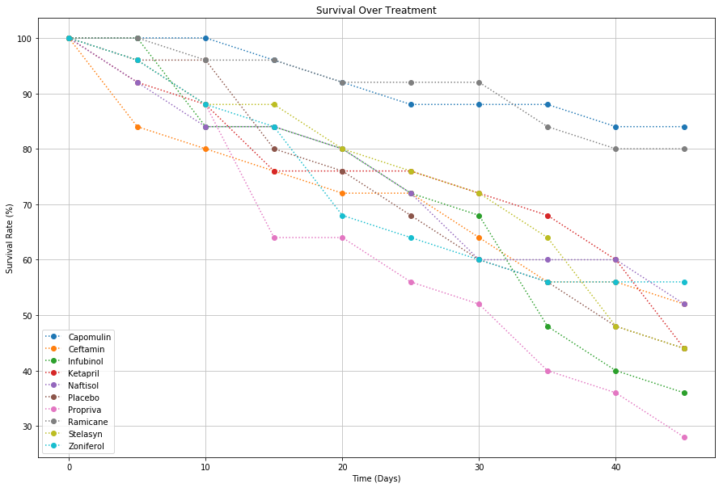

# Pymaceuticals Data Analysis

In reviewing 10 potential treatments for squamous cell carcinoma (SCC), 250 mice were tested over a 45 days period with 25 mice tested per treatment. When controlling against a placebo, 2 promising options emerge: Capomulin and Ramicane. 

Average tumor volume decreased, metastatic spread was less, and survival rate was higher for both groups versus the placebo. Ramicane demonstrated largest impact against tumor volume (10.04 mm3 decrease versus 8.76 mm3). Additionally, less metastatic spread was observed in the Ramicane group than Capomulin (1.25 site vs 1.47 site). That being said, the Capomulin group saw a higher survival rate, with 21 of the mice suriviving treatment versus 20 from the Ramicane group. Further testing would be necessary to inquire if this trend is significant.


```python
# Dependencies and Setup
%matplotlib inline
import matplotlib.pyplot as plt
import pandas as pd
import numpy as np

# Hide warning messages in notebook
import warnings
warnings.filterwarnings('ignore')

# File to Load (Remember to Change These)
mouse_file = "data/mouse_drug_data.csv"
clinical_file = "data/clinicaltrial_data.csv"

# Read the Mouse and Drug Data and the Clinical Trial Data
mouse_raw = pd.read_csv(mouse_file)
clinic_raw = pd.read_csv(clinical_file)

# Combine the data into a single dataset
mc_scrub = pd.merge(clinic_raw, mouse_raw, how="outer", on="Mouse ID")

# Display the data table for preview
mc_scrub.head()

```


<div>
<table border="1" class="dataframe">
  <thead>
    <tr style="text-align: right;">
      <th></th>
      <th>Mouse ID</th>
      <th>Timepoint</th>
      <th>Tumor Volume (mm3)</th>
      <th>Metastatic Sites</th>
      <th>Drug</th>
    </tr>
  </thead>
  <tbody>
    <tr>
      <th>0</th>
      <td>b128</td>
      <td>0</td>
      <td>45.000000</td>
      <td>0</td>
      <td>Capomulin</td>
    </tr>
    <tr>
      <th>1</th>
      <td>b128</td>
      <td>5</td>
      <td>45.651331</td>
      <td>0</td>
      <td>Capomulin</td>
    </tr>
    <tr>
      <th>2</th>
      <td>b128</td>
      <td>10</td>
      <td>43.270852</td>
      <td>0</td>
      <td>Capomulin</td>
    </tr>
    <tr>
      <th>3</th>
      <td>b128</td>
      <td>15</td>
      <td>43.784893</td>
      <td>0</td>
      <td>Capomulin</td>
    </tr>
    <tr>
      <th>4</th>
      <td>b128</td>
      <td>20</td>
      <td>42.731552</td>
      <td>0</td>
      <td>Capomulin</td>
    </tr>
  </tbody>
</table>
</div>


## Tumor Response to Treatment


```python
# Store the Mean Tumor Volume Data Grouped by Drug and Timepoint in DataFrame
drug_means = pd.DataFrame(mc_scrub.groupby(['Timepoint','Drug']).agg({'Tumor Volume (mm3)':'mean'}))
drug_means = drug_means.rename(columns={'Tumor Volume (mm3)': 'Mean Tumor Volume (mm3)'})
drug_means.head()
```


<div>
<table border="1" class="dataframe">
  <thead>
    <tr style="text-align: right;">
      <th></th>
      <th></th>
      <th>Mean Tumor Volume (mm3)</th>
    </tr>
    <tr>
      <th>Timepoint</th>
      <th>Drug</th>
      <th></th>
    </tr>
  </thead>
  <tbody>
    <tr>
      <th rowspan="5" valign="top">0</th>
      <th>Capomulin</th>
      <td>45.0</td>
    </tr>
    <tr>
      <th>Ceftamin</th>
      <td>45.0</td>
    </tr>
    <tr>
      <th>Infubinol</th>
      <td>45.0</td>
    </tr>
    <tr>
      <th>Ketapril</th>
      <td>45.0</td>
    </tr>
    <tr>
      <th>Naftisol</th>
      <td>45.0</td>
    </tr>
  </tbody>
</table>
</div>


```python
# Store the Standard Error of Tumor Volumes Grouped by Drug and Timepoint in DataFrame
drug_sems = pd.DataFrame(mc_scrub.groupby(['Timepoint','Drug']).agg({'Tumor Volume (mm3)':'sem'}))
drug_sems = drug_sems.rename(columns={'Tumor Volume (mm3)': 'Standard Error Tumor Volume (mm3)'})
drug_sems.head()

```


<div>
<style scoped>
    .dataframe tbody tr th:only-of-type {
        vertical-align: middle;
    }

    .dataframe tbody tr th {
        vertical-align: top;
    }

    .dataframe thead th {
        text-align: right;
    }
</style>
<table border="1" class="dataframe">
  <thead>
    <tr style="text-align: right;">
      <th></th>
      <th></th>
      <th>Standard Error Tumor Volume (mm3)</th>
    </tr>
    <tr>
      <th>Timepoint</th>
      <th>Drug</th>
      <th></th>
    </tr>
  </thead>
  <tbody>
    <tr>
      <th rowspan="5" valign="top">0</th>
      <th>Capomulin</th>
      <td>0.0</td>
    </tr>
    <tr>
      <th>Ceftamin</th>
      <td>0.0</td>
    </tr>
    <tr>
      <th>Infubinol</th>
      <td>0.0</td>
    </tr>
    <tr>
      <th>Ketapril</th>
      <td>0.0</td>
    </tr>
    <tr>
      <th>Naftisol</th>
      <td>0.0</td>
    </tr>
  </tbody>
</table>
</div>


```python
#unstack mean data to provide a clean DataFrame for plotting
mean_scrub = drug_means.unstack()
mean_scrub.columns = mean_scrub.columns.get_level_values(1)
mean_scrub
```


<div>
<style scoped>
    .dataframe tbody tr th:only-of-type {
        vertical-align: middle;
    }

    .dataframe tbody tr th {
        vertical-align: top;
    }

    .dataframe thead th {
        text-align: right;
    }
</style>
<table border="1" class="dataframe">
  <thead>
    <tr style="text-align: right;">
      <th>Drug</th>
      <th>Capomulin</th>
      <th>Ceftamin</th>
      <th>Infubinol</th>
      <th>Ketapril</th>
      <th>Naftisol</th>
      <th>Placebo</th>
      <th>Propriva</th>
      <th>Ramicane</th>
      <th>Stelasyn</th>
      <th>Zoniferol</th>
    </tr>
    <tr>
      <th>Timepoint</th>
      <th></th>
      <th></th>
      <th></th>
      <th></th>
      <th></th>
      <th></th>
      <th></th>
      <th></th>
      <th></th>
      <th></th>
    </tr>
  </thead>
  <tbody>
    <tr>
      <th>0</th>
      <td>45.000000</td>
      <td>45.000000</td>
      <td>45.000000</td>
      <td>45.000000</td>
      <td>45.000000</td>
      <td>45.000000</td>
      <td>45.000000</td>
      <td>45.000000</td>
      <td>45.000000</td>
      <td>45.000000</td>
    </tr>
    <tr>
      <th>5</th>
      <td>44.266086</td>
      <td>46.503051</td>
      <td>47.062001</td>
      <td>47.389175</td>
      <td>46.796098</td>
      <td>47.125589</td>
      <td>47.248967</td>
      <td>43.944859</td>
      <td>47.527452</td>
      <td>46.851818</td>
    </tr>
    <tr>
      <th>10</th>
      <td>43.084291</td>
      <td>48.285125</td>
      <td>49.403909</td>
      <td>49.582269</td>
      <td>48.694210</td>
      <td>49.423329</td>
      <td>49.101541</td>
      <td>42.531957</td>
      <td>49.463844</td>
      <td>48.689881</td>
    </tr>
    <tr>
      <th>15</th>
      <td>42.064317</td>
      <td>50.094055</td>
      <td>51.296397</td>
      <td>52.399974</td>
      <td>50.933018</td>
      <td>51.359742</td>
      <td>51.067318</td>
      <td>41.495061</td>
      <td>51.529409</td>
      <td>50.779059</td>
    </tr>
    <tr>
      <th>20</th>
      <td>40.716325</td>
      <td>52.157049</td>
      <td>53.197691</td>
      <td>54.920935</td>
      <td>53.644087</td>
      <td>54.364417</td>
      <td>53.346737</td>
      <td>40.238325</td>
      <td>54.067395</td>
      <td>53.170334</td>
    </tr>
    <tr>
      <th>25</th>
      <td>39.939528</td>
      <td>54.287674</td>
      <td>55.715252</td>
      <td>57.678982</td>
      <td>56.731968</td>
      <td>57.482574</td>
      <td>55.504138</td>
      <td>38.974300</td>
      <td>56.166123</td>
      <td>55.432935</td>
    </tr>
    <tr>
      <th>30</th>
      <td>38.769339</td>
      <td>56.769517</td>
      <td>58.299397</td>
      <td>60.994507</td>
      <td>59.559509</td>
      <td>59.809063</td>
      <td>58.196374</td>
      <td>38.703137</td>
      <td>59.826738</td>
      <td>57.713531</td>
    </tr>
    <tr>
      <th>35</th>
      <td>37.816839</td>
      <td>58.827548</td>
      <td>60.742461</td>
      <td>63.371686</td>
      <td>62.685087</td>
      <td>62.420615</td>
      <td>60.350199</td>
      <td>37.451996</td>
      <td>62.440699</td>
      <td>60.089372</td>
    </tr>
    <tr>
      <th>40</th>
      <td>36.958001</td>
      <td>61.467895</td>
      <td>63.162824</td>
      <td>66.068580</td>
      <td>65.600754</td>
      <td>65.052675</td>
      <td>63.045537</td>
      <td>36.574081</td>
      <td>65.356386</td>
      <td>62.916692</td>
    </tr>
    <tr>
      <th>45</th>
      <td>36.236114</td>
      <td>64.132421</td>
      <td>65.755562</td>
      <td>70.662958</td>
      <td>69.265506</td>
      <td>68.084082</td>
      <td>66.258529</td>
      <td>34.955595</td>
      <td>68.438310</td>
      <td>65.960888</td>
    </tr>
  </tbody>
</table>
</div>


```python
#unstack standard error data to provide a clean DataFrame for plotting
sem_scrub = drug_sems.unstack()
sem_scrub.columns = sem_scrub.columns.get_level_values(1)
sem_scrub
```


<div>
<table border="1" class="dataframe">
  <thead>
    <tr style="text-align: right;">
      <th>Drug</th>
      <th>Capomulin</th>
      <th>Ceftamin</th>
      <th>Infubinol</th>
      <th>Ketapril</th>
      <th>Naftisol</th>
      <th>Placebo</th>
      <th>Propriva</th>
      <th>Ramicane</th>
      <th>Stelasyn</th>
      <th>Zoniferol</th>
    </tr>
    <tr>
      <th>Timepoint</th>
      <th></th>
      <th></th>
      <th></th>
      <th></th>
      <th></th>
      <th></th>
      <th></th>
      <th></th>
      <th></th>
      <th></th>
    </tr>
  </thead>
  <tbody>
    <tr>
      <th>0</th>
      <td>0.000000</td>
      <td>0.000000</td>
      <td>0.000000</td>
      <td>0.000000</td>
      <td>0.000000</td>
      <td>0.000000</td>
      <td>0.000000</td>
      <td>0.000000</td>
      <td>0.000000</td>
      <td>0.000000</td>
    </tr>
    <tr>
      <th>5</th>
      <td>0.448593</td>
      <td>0.164505</td>
      <td>0.235102</td>
      <td>0.264819</td>
      <td>0.202385</td>
      <td>0.218091</td>
      <td>0.231708</td>
      <td>0.482955</td>
      <td>0.239862</td>
      <td>0.188950</td>
    </tr>
    <tr>
      <th>10</th>
      <td>0.702684</td>
      <td>0.236144</td>
      <td>0.282346</td>
      <td>0.357421</td>
      <td>0.319415</td>
      <td>0.402064</td>
      <td>0.376195</td>
      <td>0.720225</td>
      <td>0.433678</td>
      <td>0.263949</td>
    </tr>
    <tr>
      <th>15</th>
      <td>0.838617</td>
      <td>0.332053</td>
      <td>0.357705</td>
      <td>0.580268</td>
      <td>0.444378</td>
      <td>0.614461</td>
      <td>0.466109</td>
      <td>0.770432</td>
      <td>0.493261</td>
      <td>0.370544</td>
    </tr>
    <tr>
      <th>20</th>
      <td>0.909731</td>
      <td>0.359482</td>
      <td>0.476210</td>
      <td>0.726484</td>
      <td>0.595260</td>
      <td>0.839609</td>
      <td>0.555181</td>
      <td>0.786199</td>
      <td>0.621889</td>
      <td>0.533182</td>
    </tr>
    <tr>
      <th>25</th>
      <td>0.881642</td>
      <td>0.439356</td>
      <td>0.550315</td>
      <td>0.755413</td>
      <td>0.813706</td>
      <td>1.034872</td>
      <td>0.577401</td>
      <td>0.746991</td>
      <td>0.741922</td>
      <td>0.602513</td>
    </tr>
    <tr>
      <th>30</th>
      <td>0.934460</td>
      <td>0.490620</td>
      <td>0.631061</td>
      <td>0.934121</td>
      <td>0.975496</td>
      <td>1.218231</td>
      <td>0.746045</td>
      <td>0.864906</td>
      <td>0.899548</td>
      <td>0.800043</td>
    </tr>
    <tr>
      <th>35</th>
      <td>1.052241</td>
      <td>0.692248</td>
      <td>0.984155</td>
      <td>1.127867</td>
      <td>1.013769</td>
      <td>1.287481</td>
      <td>1.084929</td>
      <td>0.967433</td>
      <td>1.003186</td>
      <td>0.881426</td>
    </tr>
    <tr>
      <th>40</th>
      <td>1.223608</td>
      <td>0.708505</td>
      <td>1.055220</td>
      <td>1.158449</td>
      <td>1.118567</td>
      <td>1.370634</td>
      <td>1.564779</td>
      <td>1.128445</td>
      <td>1.410435</td>
      <td>0.998515</td>
    </tr>
    <tr>
      <th>45</th>
      <td>1.223977</td>
      <td>0.902358</td>
      <td>1.144427</td>
      <td>1.453186</td>
      <td>1.416363</td>
      <td>1.351726</td>
      <td>1.888586</td>
      <td>1.226805</td>
      <td>1.576556</td>
      <td>1.003576</td>
    </tr>
  </tbody>
</table>
</div>


```python
# use a for loop to iterate through the columns to generate a plot of the change in tumor size over time
plt.figure(figsize = (15, 10))
for column in mean_scrub:
    plt.errorbar(mean_scrub.index, mean_scrub[column], yerr=sem_scrub[column], fmt=":o")

plt.grid(color="0.75", linestyle="-")
plt.legend()
plt.title("Mean Tumor Response by Treatment")
plt.xlabel("Time (Days)")
plt.ylabel("Tumor Volume (mm3)")

# Save the Figure
plt.savefig('reponse_by_treatment.jpg')
plt.show()
```


## Metastatic Response to Treatment


```python
# Store the Mean Met. Site Data Grouped by Drug and Timepoint in DataFrame
meta_means = pd.DataFrame(mc_scrub.groupby(['Timepoint','Drug']).agg({'Metastatic Sites':'mean'}))
meta_means = meta_means.rename(columns={'Metastatic Sites': 'Mean # of Metastatic Sites'})
meta_means.head()

```


<div>
<table border="1" class="dataframe">
  <thead>
    <tr style="text-align: right;">
      <th></th>
      <th></th>
      <th>Mean # of Metastatic Sites</th>
    </tr>
    <tr>
      <th>Timepoint</th>
      <th>Drug</th>
      <th></th>
    </tr>
  </thead>
  <tbody>
    <tr>
      <th rowspan="5" valign="top">0</th>
      <th>Capomulin</th>
      <td>0.0</td>
    </tr>
    <tr>
      <th>Ceftamin</th>
      <td>0.0</td>
    </tr>
    <tr>
      <th>Infubinol</th>
      <td>0.0</td>
    </tr>
    <tr>
      <th>Ketapril</th>
      <td>0.0</td>
    </tr>
    <tr>
      <th>Naftisol</th>
      <td>0.0</td>
    </tr>
  </tbody>
</table>
</div>


```python
# Store the Standard Error associated with Met. Sites Grouped by Drug and Timepoint in Data Frame
meta_sems = pd.DataFrame(mc_scrub.groupby(['Timepoint','Drug']).agg({'Metastatic Sites':'sem'}))
meta_sems = meta_sems.rename(columns={'Metastatic Sites': 'Standard Error of Metastatic Sites'})
meta_sems.head()

```


<div>
<style scoped>
    .dataframe tbody tr th:only-of-type {
        vertical-align: middle;
    }

    .dataframe tbody tr th {
        vertical-align: top;
    }

    .dataframe thead th {
        text-align: right;
    }
</style>
<table border="1" class="dataframe">
  <thead>
    <tr style="text-align: right;">
      <th></th>
      <th></th>
      <th>Standard Error of Metastatic Sites</th>
    </tr>
    <tr>
      <th>Timepoint</th>
      <th>Drug</th>
      <th></th>
    </tr>
  </thead>
  <tbody>
    <tr>
      <th rowspan="5" valign="top">0</th>
      <th>Capomulin</th>
      <td>0.0</td>
    </tr>
    <tr>
      <th>Ceftamin</th>
      <td>0.0</td>
    </tr>
    <tr>
      <th>Infubinol</th>
      <td>0.0</td>
    </tr>
    <tr>
      <th>Ketapril</th>
      <td>0.0</td>
    </tr>
    <tr>
      <th>Naftisol</th>
      <td>0.0</td>
    </tr>
  </tbody>
</table>
</div>


```python
#unstack mean data to provide a clean DataFrame for plotting
meta_mscrub = meta_means.unstack()
meta_mscrub.columns = meta_mscrub.columns.get_level_values(1)
meta_mscrub
```


<div>
<table border="1" class="dataframe">
  <thead>
    <tr style="text-align: right;">
      <th>Drug</th>
      <th>Capomulin</th>
      <th>Ceftamin</th>
      <th>Infubinol</th>
      <th>Ketapril</th>
      <th>Naftisol</th>
      <th>Placebo</th>
      <th>Propriva</th>
      <th>Ramicane</th>
      <th>Stelasyn</th>
      <th>Zoniferol</th>
    </tr>
    <tr>
      <th>Timepoint</th>
      <th></th>
      <th></th>
      <th></th>
      <th></th>
      <th></th>
      <th></th>
      <th></th>
      <th></th>
      <th></th>
      <th></th>
    </tr>
  </thead>
  <tbody>
    <tr>
      <th>0</th>
      <td>0.000000</td>
      <td>0.000000</td>
      <td>0.000000</td>
      <td>0.000000</td>
      <td>0.000000</td>
      <td>0.000000</td>
      <td>0.000000</td>
      <td>0.000000</td>
      <td>0.000000</td>
      <td>0.000000</td>
    </tr>
    <tr>
      <th>5</th>
      <td>0.160000</td>
      <td>0.380952</td>
      <td>0.280000</td>
      <td>0.304348</td>
      <td>0.260870</td>
      <td>0.375000</td>
      <td>0.320000</td>
      <td>0.120000</td>
      <td>0.240000</td>
      <td>0.166667</td>
    </tr>
    <tr>
      <th>10</th>
      <td>0.320000</td>
      <td>0.600000</td>
      <td>0.666667</td>
      <td>0.590909</td>
      <td>0.523810</td>
      <td>0.833333</td>
      <td>0.565217</td>
      <td>0.250000</td>
      <td>0.478261</td>
      <td>0.500000</td>
    </tr>
    <tr>
      <th>15</th>
      <td>0.375000</td>
      <td>0.789474</td>
      <td>0.904762</td>
      <td>0.842105</td>
      <td>0.857143</td>
      <td>1.250000</td>
      <td>0.764706</td>
      <td>0.333333</td>
      <td>0.782609</td>
      <td>0.809524</td>
    </tr>
    <tr>
      <th>20</th>
      <td>0.652174</td>
      <td>1.111111</td>
      <td>1.050000</td>
      <td>1.210526</td>
      <td>1.150000</td>
      <td>1.526316</td>
      <td>1.000000</td>
      <td>0.347826</td>
      <td>0.952381</td>
      <td>1.294118</td>
    </tr>
    <tr>
      <th>25</th>
      <td>0.818182</td>
      <td>1.500000</td>
      <td>1.277778</td>
      <td>1.631579</td>
      <td>1.500000</td>
      <td>1.941176</td>
      <td>1.357143</td>
      <td>0.652174</td>
      <td>1.157895</td>
      <td>1.687500</td>
    </tr>
    <tr>
      <th>30</th>
      <td>1.090909</td>
      <td>1.937500</td>
      <td>1.588235</td>
      <td>2.055556</td>
      <td>2.066667</td>
      <td>2.266667</td>
      <td>1.615385</td>
      <td>0.782609</td>
      <td>1.388889</td>
      <td>1.933333</td>
    </tr>
    <tr>
      <th>35</th>
      <td>1.181818</td>
      <td>2.071429</td>
      <td>1.666667</td>
      <td>2.294118</td>
      <td>2.266667</td>
      <td>2.642857</td>
      <td>2.300000</td>
      <td>0.952381</td>
      <td>1.562500</td>
      <td>2.285714</td>
    </tr>
    <tr>
      <th>40</th>
      <td>1.380952</td>
      <td>2.357143</td>
      <td>2.100000</td>
      <td>2.733333</td>
      <td>2.466667</td>
      <td>3.166667</td>
      <td>2.777778</td>
      <td>1.100000</td>
      <td>1.583333</td>
      <td>2.785714</td>
    </tr>
    <tr>
      <th>45</th>
      <td>1.476190</td>
      <td>2.692308</td>
      <td>2.111111</td>
      <td>3.363636</td>
      <td>2.538462</td>
      <td>3.272727</td>
      <td>2.571429</td>
      <td>1.250000</td>
      <td>1.727273</td>
      <td>3.071429</td>
    </tr>
  </tbody>
</table>
</div>


```python
#unstack mean data to provide a clean DataFrame for plotting
meta_sscrub = meta_sems.unstack()
meta_sscrub.columns = meta_sscrub.columns.get_level_values(1)
meta_sscrub
```


<div>
<table border="1" class="dataframe">
  <thead>
    <tr style="text-align: right;">
      <th>Drug</th>
      <th>Capomulin</th>
      <th>Ceftamin</th>
      <th>Infubinol</th>
      <th>Ketapril</th>
      <th>Naftisol</th>
      <th>Placebo</th>
      <th>Propriva</th>
      <th>Ramicane</th>
      <th>Stelasyn</th>
      <th>Zoniferol</th>
    </tr>
    <tr>
      <th>Timepoint</th>
      <th></th>
      <th></th>
      <th></th>
      <th></th>
      <th></th>
      <th></th>
      <th></th>
      <th></th>
      <th></th>
      <th></th>
    </tr>
  </thead>
  <tbody>
    <tr>
      <th>0</th>
      <td>0.000000</td>
      <td>0.000000</td>
      <td>0.000000</td>
      <td>0.000000</td>
      <td>0.000000</td>
      <td>0.000000</td>
      <td>0.000000</td>
      <td>0.000000</td>
      <td>0.000000</td>
      <td>0.000000</td>
    </tr>
    <tr>
      <th>5</th>
      <td>0.074833</td>
      <td>0.108588</td>
      <td>0.091652</td>
      <td>0.098100</td>
      <td>0.093618</td>
      <td>0.100947</td>
      <td>0.095219</td>
      <td>0.066332</td>
      <td>0.087178</td>
      <td>0.077709</td>
    </tr>
    <tr>
      <th>10</th>
      <td>0.125433</td>
      <td>0.152177</td>
      <td>0.159364</td>
      <td>0.142018</td>
      <td>0.163577</td>
      <td>0.115261</td>
      <td>0.105690</td>
      <td>0.090289</td>
      <td>0.123672</td>
      <td>0.109109</td>
    </tr>
    <tr>
      <th>15</th>
      <td>0.132048</td>
      <td>0.180625</td>
      <td>0.194015</td>
      <td>0.191381</td>
      <td>0.158651</td>
      <td>0.190221</td>
      <td>0.136377</td>
      <td>0.115261</td>
      <td>0.153439</td>
      <td>0.111677</td>
    </tr>
    <tr>
      <th>20</th>
      <td>0.161621</td>
      <td>0.241034</td>
      <td>0.234801</td>
      <td>0.236680</td>
      <td>0.181731</td>
      <td>0.234064</td>
      <td>0.171499</td>
      <td>0.119430</td>
      <td>0.200905</td>
      <td>0.166378</td>
    </tr>
    <tr>
      <th>25</th>
      <td>0.181818</td>
      <td>0.258831</td>
      <td>0.265753</td>
      <td>0.288275</td>
      <td>0.185240</td>
      <td>0.263888</td>
      <td>0.199095</td>
      <td>0.119430</td>
      <td>0.219824</td>
      <td>0.236621</td>
    </tr>
    <tr>
      <th>30</th>
      <td>0.172944</td>
      <td>0.249479</td>
      <td>0.227823</td>
      <td>0.347467</td>
      <td>0.266667</td>
      <td>0.300264</td>
      <td>0.266469</td>
      <td>0.139968</td>
      <td>0.230641</td>
      <td>0.248168</td>
    </tr>
    <tr>
      <th>35</th>
      <td>0.169496</td>
      <td>0.266526</td>
      <td>0.224733</td>
      <td>0.361418</td>
      <td>0.330464</td>
      <td>0.341412</td>
      <td>0.366667</td>
      <td>0.145997</td>
      <td>0.240983</td>
      <td>0.285714</td>
    </tr>
    <tr>
      <th>40</th>
      <td>0.175610</td>
      <td>0.289128</td>
      <td>0.314466</td>
      <td>0.315725</td>
      <td>0.321702</td>
      <td>0.297294</td>
      <td>0.433903</td>
      <td>0.160591</td>
      <td>0.312815</td>
      <td>0.299791</td>
    </tr>
    <tr>
      <th>45</th>
      <td>0.202591</td>
      <td>0.286101</td>
      <td>0.309320</td>
      <td>0.278722</td>
      <td>0.351104</td>
      <td>0.304240</td>
      <td>0.428571</td>
      <td>0.190221</td>
      <td>0.359062</td>
      <td>0.286400</td>
    </tr>
  </tbody>
</table>
</div>


```python
# use a for loop to iterate through the columns to generate a plot of the change in tumor size over time
plt.figure(figsize = (15, 10))
for column in meta_mscrub:
    plt.errorbar(meta_mscrub.index, meta_mscrub[column], yerr=meta_sscrub[column], fmt=":o")

plt.grid(color="0.75", linestyle="-")
plt.legend()
plt.title("Mean Metastatic Spread by Treatment")
plt.xlabel("Time (Days)")
plt.ylabel("Number of Met. Sites")

# Save the Figure
plt.savefig('meta_sites_by_treatment.jpg')
plt.show()
```


## Survival Rates


```python
# Store the Count of Mice Grouped by Drug and Timepoint with unique counts of Mouse ID to determine survival rate
mouse_counts = pd.DataFrame(mc_scrub.groupby(['Timepoint','Drug']).agg({'Mouse ID':'nunique'}))
mouse_counts.head()
```


<div>
<table border="1" class="dataframe">
  <thead>
    <tr style="text-align: right;">
      <th></th>
      <th></th>
      <th>Mouse ID</th>
    </tr>
    <tr>
      <th>Timepoint</th>
      <th>Drug</th>
      <th></th>
    </tr>
  </thead>
  <tbody>
    <tr>
      <th rowspan="5" valign="top">0</th>
      <th>Capomulin</th>
      <td>25</td>
    </tr>
    <tr>
      <th>Ceftamin</th>
      <td>25</td>
    </tr>
    <tr>
      <th>Infubinol</th>
      <td>25</td>
    </tr>
    <tr>
      <th>Ketapril</th>
      <td>25</td>
    </tr>
    <tr>
      <th>Naftisol</th>
      <td>25</td>
    </tr>
  </tbody>
</table>
</div>


```python
# Minor Data Munging to Re-Format the Data Frames
mc_scrub = mouse_counts.unstack()
mc_scrub.columns = mc_scrub.columns.get_level_values(1)
mc_scrub
```


<div>
<table border="1" class="dataframe">
  <thead>
    <tr style="text-align: right;">
      <th>Drug</th>
      <th>Capomulin</th>
      <th>Ceftamin</th>
      <th>Infubinol</th>
      <th>Ketapril</th>
      <th>Naftisol</th>
      <th>Placebo</th>
      <th>Propriva</th>
      <th>Ramicane</th>
      <th>Stelasyn</th>
      <th>Zoniferol</th>
    </tr>
    <tr>
      <th>Timepoint</th>
      <th></th>
      <th></th>
      <th></th>
      <th></th>
      <th></th>
      <th></th>
      <th></th>
      <th></th>
      <th></th>
      <th></th>
    </tr>
  </thead>
  <tbody>
    <tr>
      <th>0</th>
      <td>25</td>
      <td>25</td>
      <td>25</td>
      <td>25</td>
      <td>25</td>
      <td>25</td>
      <td>25</td>
      <td>25</td>
      <td>25</td>
      <td>25</td>
    </tr>
    <tr>
      <th>5</th>
      <td>25</td>
      <td>21</td>
      <td>25</td>
      <td>23</td>
      <td>23</td>
      <td>24</td>
      <td>24</td>
      <td>25</td>
      <td>24</td>
      <td>24</td>
    </tr>
    <tr>
      <th>10</th>
      <td>25</td>
      <td>20</td>
      <td>21</td>
      <td>22</td>
      <td>21</td>
      <td>24</td>
      <td>22</td>
      <td>24</td>
      <td>22</td>
      <td>22</td>
    </tr>
    <tr>
      <th>15</th>
      <td>24</td>
      <td>19</td>
      <td>21</td>
      <td>19</td>
      <td>21</td>
      <td>20</td>
      <td>16</td>
      <td>24</td>
      <td>22</td>
      <td>21</td>
    </tr>
    <tr>
      <th>20</th>
      <td>23</td>
      <td>18</td>
      <td>20</td>
      <td>19</td>
      <td>20</td>
      <td>19</td>
      <td>16</td>
      <td>23</td>
      <td>20</td>
      <td>17</td>
    </tr>
    <tr>
      <th>25</th>
      <td>22</td>
      <td>18</td>
      <td>18</td>
      <td>19</td>
      <td>18</td>
      <td>17</td>
      <td>14</td>
      <td>23</td>
      <td>19</td>
      <td>16</td>
    </tr>
    <tr>
      <th>30</th>
      <td>22</td>
      <td>16</td>
      <td>17</td>
      <td>18</td>
      <td>15</td>
      <td>15</td>
      <td>13</td>
      <td>23</td>
      <td>18</td>
      <td>15</td>
    </tr>
    <tr>
      <th>35</th>
      <td>22</td>
      <td>14</td>
      <td>12</td>
      <td>17</td>
      <td>15</td>
      <td>14</td>
      <td>10</td>
      <td>21</td>
      <td>16</td>
      <td>14</td>
    </tr>
    <tr>
      <th>40</th>
      <td>21</td>
      <td>14</td>
      <td>10</td>
      <td>15</td>
      <td>15</td>
      <td>12</td>
      <td>9</td>
      <td>20</td>
      <td>12</td>
      <td>14</td>
    </tr>
    <tr>
      <th>45</th>
      <td>21</td>
      <td>13</td>
      <td>9</td>
      <td>11</td>
      <td>13</td>
      <td>11</td>
      <td>7</td>
      <td>20</td>
      <td>11</td>
      <td>14</td>
    </tr>
  </tbody>
</table>
</div>


```python
# Generate the Plot (Accounting for percentages) to visualize mouse survival rate over time
plt.figure(figsize = (15, 10))
for column in mc_scrub:
    plt.plot(mc_scrub.index, (mc_scrub[column]/25)*100, linestyle=":", marker="o")
plt.grid(color="0.75", linestyle="-")
plt.legend()
plt.title("Survival Over Treatment")
plt.xlabel("Time (Days)")
plt.ylabel("Survival Rate (%)")

# Save the Figure
plt.savefig('survival_rate_by_treatment.jpg')
plt.show()
```





## Summary Bar Graph


```python
# Calculate the percent changes for each drug via dictionary
tumor_change = {}
for column in mean_scrub:
    tumor_change[column] = ((mean_scrub.loc[45, column] - mean_scrub.loc[0, column])/mean_scrub.loc[0, column])*100
```


```python
#Convert dictionary to DataFrame for further parsing
change_summ = pd.DataFrame.from_dict(tumor_change, orient='index')
change_summ['Tumor Shrink?'] = change_summ[0] < 0
change_summ = change_summ.rename(columns={0: '%Change in Mean Tumor Volume'})
change_summ
```


<div>
<table border="1" class="dataframe">
  <thead>
    <tr style="text-align: right;">
      <th></th>
      <th>%Change in Mean Tumor Volume</th>
      <th>Tumor Shrink?</th>
    </tr>
  </thead>
  <tbody>
    <tr>
      <th>Capomulin</th>
      <td>-19.475303</td>
      <td>True</td>
    </tr>
    <tr>
      <th>Ceftamin</th>
      <td>42.516492</td>
      <td>False</td>
    </tr>
    <tr>
      <th>Infubinol</th>
      <td>46.123472</td>
      <td>False</td>
    </tr>
    <tr>
      <th>Ketapril</th>
      <td>57.028795</td>
      <td>False</td>
    </tr>
    <tr>
      <th>Naftisol</th>
      <td>53.923347</td>
      <td>False</td>
    </tr>
    <tr>
      <th>Placebo</th>
      <td>51.297960</td>
      <td>False</td>
    </tr>
    <tr>
      <th>Propriva</th>
      <td>47.241175</td>
      <td>False</td>
    </tr>
    <tr>
      <th>Ramicane</th>
      <td>-22.320900</td>
      <td>True</td>
    </tr>
    <tr>
      <th>Stelasyn</th>
      <td>52.085134</td>
      <td>False</td>
    </tr>
    <tr>
      <th>Zoniferol</th>
      <td>46.579751</td>
      <td>False</td>
    </tr>
  </tbody>
</table>
</div>


```python
# set figure dimensions for easy reading
plt.figure(figsize = (15, 10))
#determine plot figure based on the change in summary DataFrame
change_vis = change_summ['%Change in Mean Tumor Volume'].plot(kind="bar", color=change_summ['Tumor Shrink?'].map({True: 'g', False: 'r'}))

#set aesthetics and titles
plt.grid(color="0.75", linestyle=":")
plt.title("Tumor Volume Change Over 45 Day Treatment")
plt.xlabel("Treatment")
plt.ylabel("%Volume Change")
plt.gca().set_yticklabels(['{:.0f}%'.format(x) for x in plt.gca().get_yticks()]) 

# Use a for loop to add column value labels
totals = []
for c in change_vis.patches:
    #capture the value
    y_val = c.get_height()
    #determine the position the label needs to be
    if y_val < 0:
        y_pos = -5
    else:
        y_pos = 5
    #write the text
    change_vis.text(c.get_x()+.03, y_pos, str(round(y_val,2))+ "%", fontsize=10, color='white')

# Save the Figure
plt.savefig('tumor_change_by_treatment.jpg')

# Show the Figure
plt.show()
```


